ReSTIR with DirectX Raytracing
================

**University of Pennsylvania, CIS 565: GPU Programming and Architecture, Final Project**

* Jilin Liu
  * [LinkedIn](https://www.linkedin.com/in/jilin-liu97/), [twitter](https://twitter.com/Jilin18043110).
* Keyi Yu
  * [LinkedIn](https://www.linkedin.com/in/keyi-linda-yu-8b1178137/).
* Li Zheng
  * [LinkedIn](https://www.linkedin.com/in/li-zheng-1955ba169/).

Contents
-------------------------------------
- [Introduction](#Introduction)
- [Pipeline Overview](#Pipeline-Overview)
- [Algorithm Details](#Algorithm-Details)
  - [Why resampling?](#Why-resampling?)
  - [What is a reservoir?](#What-is-a-reservoir?)
  - [Spatial reuse](#Spatial-reuse)
  - [Temporal reuse](#Temporal-reuse)
  - [Raytraced G-Buffer and visibility test](#Raytraced-G\-Buffer-and-visibility-test)
  - [Denoising pass](#Denoising-pass)
- [Performance Analysis](#Performance-Analysis)
- [Limitations](#Limitations)
- [Acknowledgements](#Acknowledgements)

## Introduction

This repository contains our implementation of **Reservoir-based SpatioTemporal Importance Resampling(i.e. ReSTIR)** with DirectX Raytracing. Our base code is from Chris Wyman's DXR tutorials ["A Gentle Introduction To DirectX Raytracing"](http://cwyman.org/code/dxrTutors/dxr_tutors.md.html). He is also one of the authors of our reference paper on SIGGRAPH 2020. The code is dependent on Nvidia's [Falcor](https://developer.nvidia.com/falcor) framework.

## Pipeline Overview

Our pipeline is comprised of 5 passes with an optional denoiser pass. The first two use the raytracing shader while others use the pixel shader.

1. **Raytraced G-Buffer and RIS**. In the beginning, we use DXR to shoot rays from camera and collect G-Buffer informations. We also use a reservoir for each pixel to store the resampled importance sampling results. G-Buffer and our reservoirs are encoded and stored in textures that can be shared with following passes.

2. **Raytraced Visibility Test**. In the second pass, we shoot one shadow ray per pixel for our selected candidate in the first pass. If the candidate(sample) is occluded from our reference point, the weight in the reservoir will be set to zero so that the current pixel won't get contribution from that light sample. This guarantees that occluded samples will not propagate to neighboring pixels.

3. **Temporal Reuse Pixel Shader**. From this pass, we start using pixel shader, which only reads from textures and do some calculation. Given the hit point(reference point) of current pixel, we multiply it by previous frame's view-projection matrix to get the corresponding pixel position in last frame. We then combine the current reservoir with the reservoir of that corresponding pixel to reuse samples from last frame. Sample numbers are clamped and weights are scaled here to avoid unbounded growth of sample count.

4. **Spatial Reuse Pixel Shader**. In this pass, we combine the current reservoir with several reservoirs in a neighborhood in screen space. Given the adjacent pixel usually share similar lighting conditions and occlusions, this step makes it possible to reuse a lot of good samples. However, it also introduces bias. Currently, our ReSTIR is a biased version. We only limit the bias by rejecting neighbor's reservoir when normal difference or depth difference exceeds some threshold.

5. **Shade Pixel**. This step utilizes the reservoir and G-Buffer from previous passes and shade the current pixel to get the final image.

6. **Optional A-Trous Denoiser**. In this pass we filter the image using the Edge-avoiding A-Trous Wavelet Transform to denoise the image we just rendered.

## Algorithm Details
In this section, we would like to share some implementation details and also our own understanding of the algorithm.

### Why resampling?
In a scene with millions of lights, it is not practical for a real-time application to shoot a shadow ray for each light source to check visibility and compute the shading for that light due to the high complexity in computation. While it is OK to randomly choose a light from the scene to shade our pixel, it generates very noisy image because it is hard to sample the "just right light" which is not occluded by other objects.

But we can do much better if we can reuse samples! Suppose we have two samples for a given point, one is occluded while the other is not. To reduce noise, we would like to use the sample that can actually illuminate our point of interest. In the meanwhile, we also would like to use the occluded sample for a lower probability to create partially occluded effects or soft shadows. The probability can be determined by assigning weights to samples. If a sample has a greater contribution, it should be given a higher weight to be chosen. The basic resampling importance sampling algorithm simply repeats the sampling process and select a sample from candidates based on their weights.

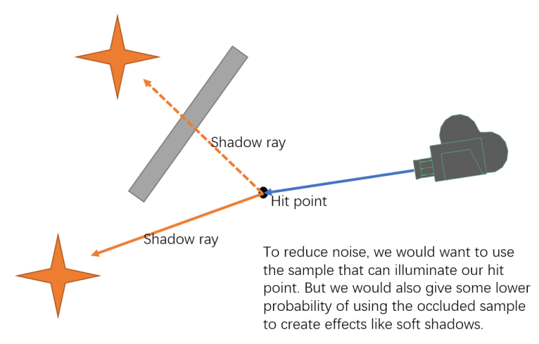

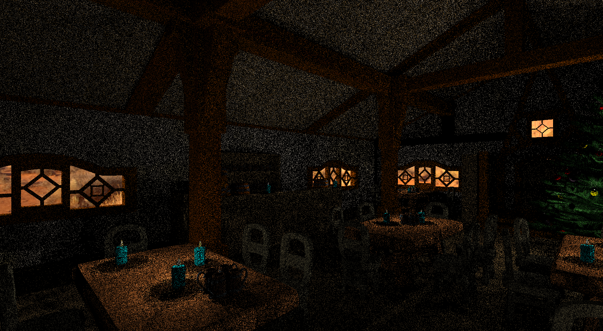

### What is a reservoir?
We can get more converged results as we increase the number of samples in the resampling stage. But the execution time also increase linearly. Thanks to the reservoir, we can potentially see a lot of samples and select one from them based on their weights. A reservoir maintains a state from a streaming input. It contains the number of samples seen so far, the weight of the currently selected sample and the sum of sample weights from the input stream. The idea is similar to computing mean score of students from a streaming input: we simply record the sum of all scores we have seen so far and the number of students so that we can update the mean score given a new input. A reservoir is powerful in that it requires little memory while allowing us to potentially see a lot of samples.

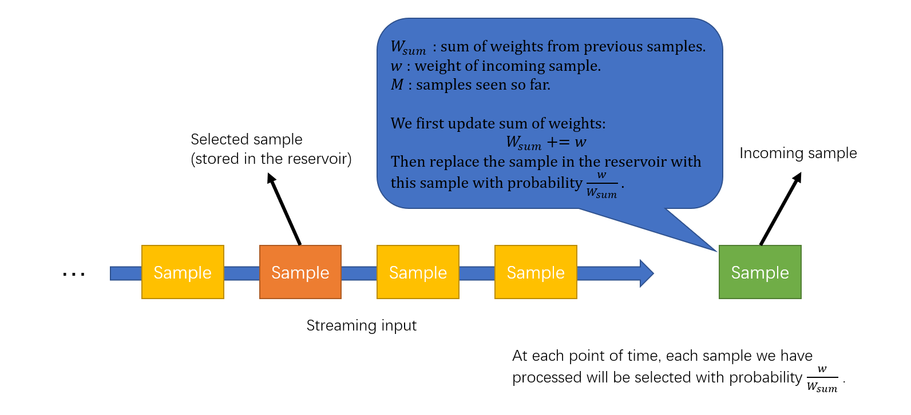
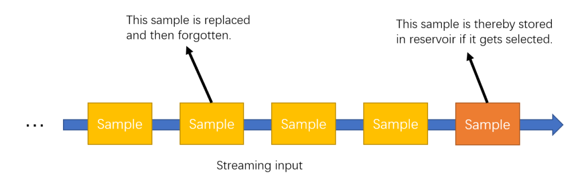

### Spatial reuse
Reservoir provides simplicity in reusing samples. As we can reuse samples from a lot of candidates, it is a good idea to reuse samples from neighboring pixels. Because the neighboring pixels usually share the same lighting conditions and occlusion conditions, we can potentially get more good samples from a neighborhood. In this step we will change the value in reservoir for each pixel. As we use shaders to do the calculation, we need to avoid race condition by using a ping-pong buffer. After we have updated the ping-pong buffer, we copy it back to the current reservoir.

However, reusing samples from neighboring pixels can potentially introduce **bias**. The reason is that we combine reservoirs and update reservoir's selected sample based on weights. While weights come from evaluating rendering equations, different pixels have different evaluations and different integration domains. In the paper, there is a more in-depth discussion about how to eliminate bias using a more accurate algorithm which is also a little more expensive. Here we just implemented the biased version since it is visually good enough and also runs faster.

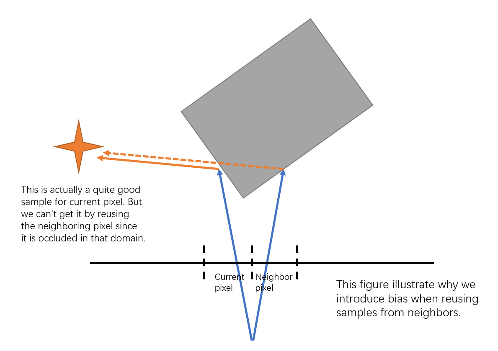

We limit the bias introduced here by rejecting neighbors if either the difference between surface normals or the difference between scene depth exceeds a threshold. We use the same parameters as is mentioned in the paper (25 degrees and 10% of current pixels depth, respectively).

We can also apply spatial reuse more than once. In our pipeline we have two spatial reuse passes. Here is a result after applying spatial reuse.

### Temporal reuse
Reservoirs in the previous frame can also provide useful information. We find the corresponding pixel position in the previous frame by applying the motion vector, which can be easily computed using the previous frame's view projection matrix. We then combine the reservoir from previous frame with our current reservoir. In Falcor, textures can be shared through frames. We use the ping-poing buffer in the previous frame as the input of last frame's reservoir.

Sometimes the corresponding fragment position in the previous frame will be occluded by other fragments. We can detect the occlusion by checking the difference of last world position with the current world position. As is discussed in the spatial reuse section, this can potentially increase bias because fragments coming from different geometries might have totally different integration domains. However, rejecting reservoirs in this case seems to introduce some artifacts so we don't do anything here. To eliminate these artifacts can be an interesting future work.

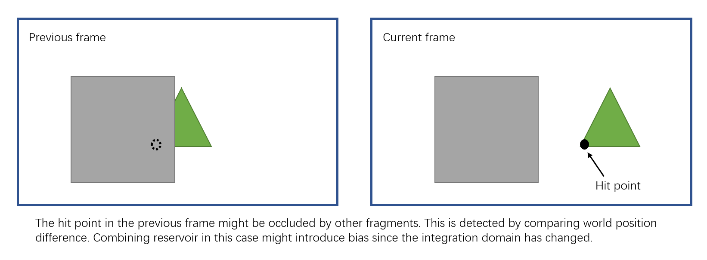

Below is the result after applying spatial reuse and temporal reuse.

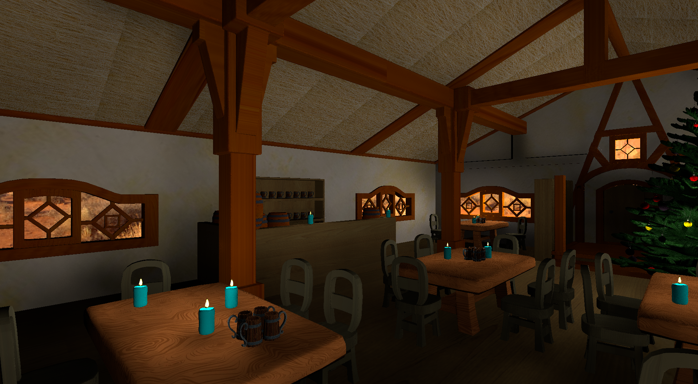

We use an integer to store the number of samples seen so far. As we combine reservoirs from previous frame, this number will increase exponentially and go unbounded. Which gives us very interesting bug images below. To fix this, we clamp the number of samples seen so far and also scale the sum of weights accordingly. This is like assigning a weight to previous frames' reservoirs and will bound the influence of temporal information.

### Raytraced G-Buffer and visibility test
In the context of DXR, we have several types raytracing shaders: Ray generation shader, Intersection shader(s), Miss shader(s), Closest-hit shader(s), Any-hit shader(s). We use ray generation shader to shoot rays from our camera and then collect G-Buffers at the closest-hit. RIS is also executed at this stage.

We then shoot another ray for each pixel in the next raytracing pass. It only uses ray generation shader to test the visibility of a given sample from RIS and sets the weight of the corresponding reservoir to zero if it is occluded. This prevents shadow from propogating to neighboring pixels.

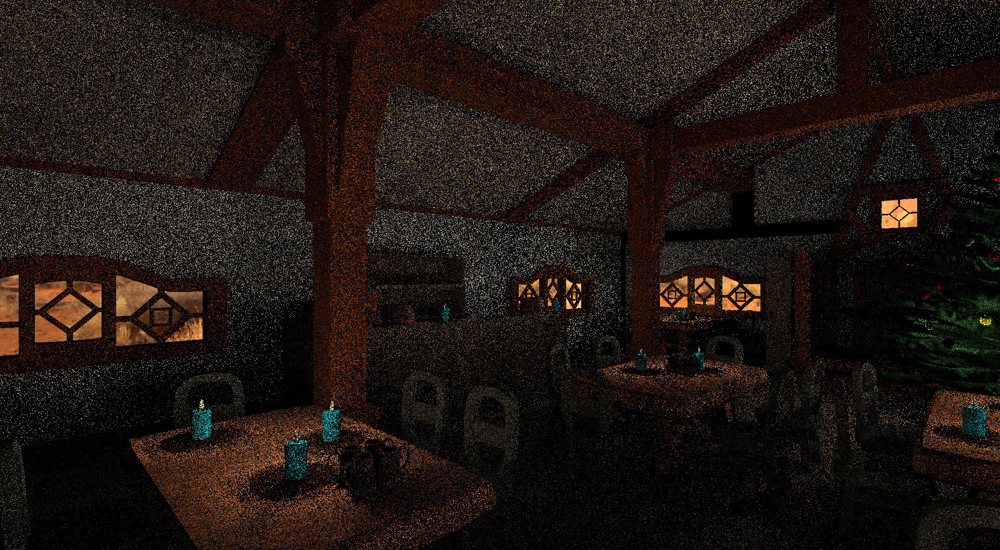

### Denoising pass
The image is almost clean after spatial and temporal reuse. But we still add an optional denoising stage to our pipeline. We use the Edge-avoiding A-Trous Wavelet Transform to denoise our rendered image. Each filter iteration takes about 2ms on RTX 2070. We also tried integrating Intel Open Image Denoiser into our pipeline but each frame will then spend about 1.5 seconds in applying the filter, which is impractical for real-time applications. Denoising provides limited improvement to the final result and sometimes can even introduce artifacts.

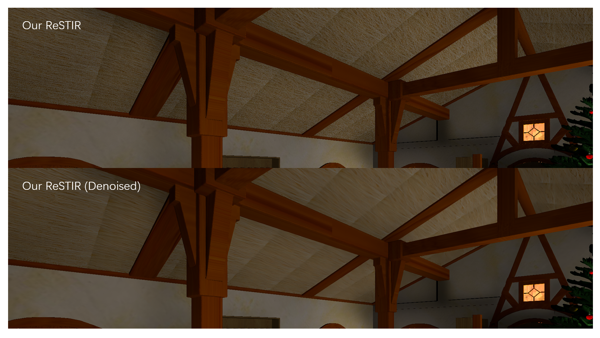

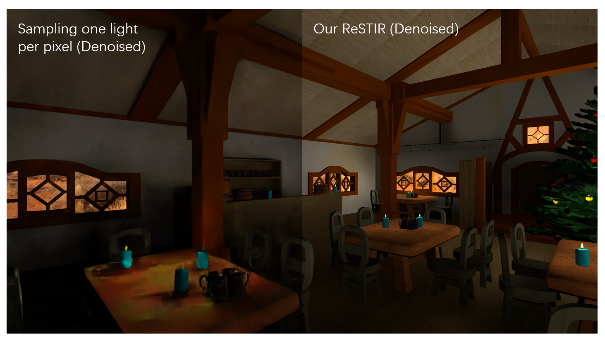

## Performance Analysis
Our test scene "Pub" is created by all the team members. It contains 989392 triangles, 130 point lights and 5 area lights. Other scenes are provided on https://developer.nvidia.com/orca. The test is operated on a laptop with Windows 10, i7-10750H @ 2.60GHz 16GB, GeForce RTX 2070 with Max-Q 8228MB.

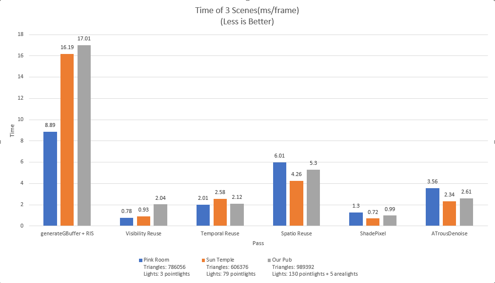

As you can see in the image, the first pass is the most expensive one. It uses ray tracing and contains several iteration of resampling.

The second pass also uses raytracing, but doesn't contain many heavy computations. So it is a good reference for us to inspect how long the raytracing part should take up in the pipeline. With a hardware acceleration and acceleration data structure, DirectX Raytracing is very fast even in a scene with almost one million triangles.

Based on that, the raytraced G-Buffer only adds a little overhead to our first pass. Theoritically the execution time of RIS is proportional to the iteration times of resampling. But actually what we have observed is that it is also affected by the number of lights. As the number of lights increase, the memory it takes will also increase dramatically since each light stores a lot of information like direction, transform, color, surface area and DirectX requires padding for the data structure. Since we are randomly accessing each light in each resampling step, a scene with more lights will typically take a longer time to sample a light source.

Both temporal reuse and spatial reuse will read and update reservoir information, which is stored in texture. Their execution time are related to how many textures we use. We apply two spatial reuse and as a result the exectuion time of spatial reuse passes in total is about twice as long as a temporal reuse pass.

## Limitations
For now our scene only supports area lights and point lights. It doesn't support mesh lights which contain arbitrary sets of triangles. ReSTIR is powerful even when it is dealing with millions of triangles from mesh lights. This can be a very interesting part for our future work. We only support lambertian material in the scene. Also as mentioned before, we do not have an unbiased version of ReSTIR. Finally, the algorithm is using raytracing instead of pathtracing so no global illumination is included here.

## Acknowledgements
We used some models from Amazon Lumberyard Bistro. See
    http://developer.nvidia.com/orca/amazon-lumberyard-bistro

The desert HDR environment map (MonValley Dirtroad) is provided from the sIBL Archive under a 
Creative Commons license (CC BY-NC-SA 3.0 US). See
    http://www.hdrlabs.com/sibl/archive.html 

The included "pink_room" scene is named 'The Modern Living Room' by Wig42 on Benedikt Bitterli's
webpage (https://benedikt-bitterli.me/resources/).  It has been modified to match the Falcor 
material system.  This scene was released under a CC-BY license.  It may be copied, modified and 
used commercially without permission, as long as: Appropriate credit is given to the original author
The original scene file may be obtained here: 
    http://www.blendswap.com/blends/view/75692
